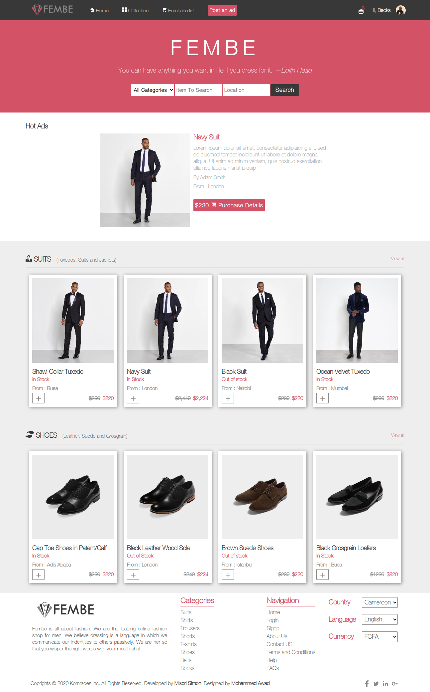

# Online fashion shop

## Definition

I have used sass preprosessor to design an online fashion shop. Inspired by the design of Mohammed Awad on Behance.

## About the Project

The project is about developing a responsive online store of atleast two pages, home page and the result pages.

The features of this project are listed as below:
1. Website has a header:
    - With logo, menu items, notifictaion, user name and profile picture.
    - The header also conatains a hero section with a title, slogan and seacrch form
2. Index page has a slider for ads
3. The index page has two rows of product categories on display.
4. The result page has a filter section to filter search
5. The  result page has a listing of search results.
6. Has a footer with
   - logo, brief about; categories, navigation links, form
   - Copy right information and social icons.

## Built With

- HTML5
- CSS3
- SASS

## Live Demo

<<<<<<< HEAD
[Live Demo Link](https://misori-simon.github.io/online-gadget-shop/)  
=======
[Live Demo Link](https://misori-simon.github.io/online-gadget-shop/)
>>>>>>> 1d35e726cf4a578b8572713cee2f6eeb74937de9
[Video presentation](https://www.loom.com/share/a1c19cd3e1294487b0fc66de8bd28bfd)

## Getting Started

**Just clone this repo and open index.html file in your browser then you are good to go.**

**To get a local copy up and running follow these simple example steps.**

### clone the repo.

## Authors

👤 **Misori Simon**

  - GitHub: [Misori-simon](https://github.com/Misori-simon/)
  - Twitter: [@misori_simon](https://twitter.com/misori_simon)
  - LinkedIn: [Misori Simon](https://cm.linkedin.com/in/misori-simon-05906219b)

## 🤝 Contributing

Contributions, issues, and feature requests are welcome!

## Show your support

Give a ⭐️ if you like this project!

## Acknowledgments
- [Mohammed Awad](https://www.behance.net/gallery/24796463/ZATTIX) for his design
- icons used from [iconify](https://iconify.design/)
- Images used in this shop is from [The black tux](https://theblacktux.com)

## 📝 License

This project is [MIT](./LICENSE) licensed.
